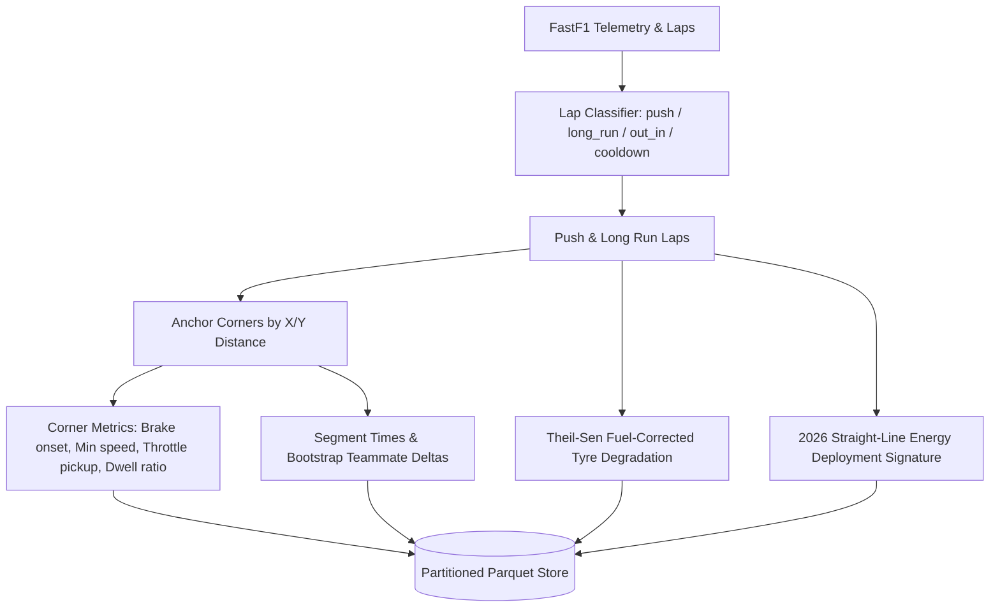

# Implementation Plan: Formula 1 AI Race Engineer (Phase 1)

This plan implements **Phase 1: Surface Laptop 3** of the Formula 1 AI Race Engineer as defined in [`docs/surface/roadmap.md`](file:///d:/coding/f1/franz-hermann/docs/surface/roadmap.md). It establishes an end-to-end, deterministic telemetry and physics pipeline coupled with a local LLM post-session debrief engine and an MCP server for IDE / local assistant querying.

---

## Goal Description

Build a high-reliability, CPU-friendly F1 telemetry analysis and race engineering system based on the v2 architecture:
1. **Deterministic Calculation Layer**: FastF1 ingestion, run-type classification (`push`, `long_run`, `out_in`, `cooldown`, `invalid`), corner anchoring by X/Y coordinate, corner telemetry metrics, bootstrap segment deltas, Theil-Sen fuel-corrected tyre degradation, and 2026 straight-line electrical energy deployment analysis.
2. **Lock-Free Partitioned Storage**: Per-session Hive-partitioned Parquet files written atomically via staging folders, queried through in-memory DuckDB views.
3. **Model Context Protocol (MCP) Server**: Stdio read-only `f1_*` tools exposing sessions, drivers, corners, corner comparisons, segment deltas, tyre degradation, energy signatures, debrief highlights, and schema resources.
4. **Local LLM Integration (Ollama)**: Centralized model wrapper enforcing `think=False` for `qwen3.5:4b` and `granite4.2:8b`, with thinking-leak assertions, structured output parsing, and an agent harness.
5. **Debrief Pipeline**: Post-session fact-sheet extraction, one structured LLM call per team, strict grounding validation, retry with error diagnostics, deterministic fallback, and dual output (Parquet `session_highlights` and Markdown reports).
6. **Testing & Eval Set**: Physics invariants, MCP tool verification, grounding tests, model thinking checks, and a benchmark eval suite (`evals/questions.yaml` -> `evals/results.csv`).

---

## User Review Required

> [!IMPORTANT]
> **Virtual Environment & Package Manager**:
> The workspace contains a virtual environment at [`.venv`](file:///d:/coding/f1/franz-hermann/.venv) running Python 3.13.14. We will use this environment directly (`.venv\Scripts\python.exe` and `.venv\Scripts\pip.exe`) and configure `pyproject.toml` in editable mode (`pip install -e .`).

> [!NOTE]
> **Ollama Models**:
> Both required local models (`qwen3.5:4b` and `granite4.2:8b`) are already downloaded in your local Ollama instance (`0.35.1`).

> [!TIP]
> **Golden Fixture Sessions**:
> Real session data from recent F1 seasons (e.g. 2024 Italian GP Monza FP2 for high-speed/low-downforce and 2024 Spanish GP Barcelona FP2 for cornering/tyre degradation) will be ingested and cached as the golden test fixtures to validate anchoring, corner metrics, lap classification, and degradation slopes before live 2026 session ingestion.

---

## Proposed Changes

### Milestone 1: Foundation & Data Layer

Set up project configuration, directory structure, package metadata, FastF1 caching, Parquet partitioning, DuckDB view connections, and lap classification.

#### [NEW] `pyproject.toml`
- Package definition for `f1_ai` with dependencies: `fastf1`, `duckdb`, `pyarrow`, `pandas`, `numpy`, `scipy`, `pydantic`, `mcp[cli]`, `ollama`, `httpx`, `pyyaml`, and `pytest`.
- Configured for editable install into `.venv`.

#### [NEW] [`.env.example`](file:///d:/coding/f1/franz-hermann/.env.example)
- Environment variable templates for `F1_ROOT`, `F1_DATA_DIR`, `F1_DEBRIEF_MODEL`, `F1_CHAT_MODEL`, `F1_FUEL_KG_PER_LAP`, `F1_FUEL_S_PER_KG`, `F1_MCP_ENABLE_SQL`.

#### [NEW] `src/f1_ai/config.py`
- Global path resolution (`ROOT`, `DATA_DIR`, `CACHE_DIR`, `PARQUET_DIR`, `REPORTS_DIR`).
- Model execution profiles (`ModelProfile` for `qwen3.5:4b` and `granite4.2:8b` with sampling parameters).
- Threshold constants (`PUSH_THRESHOLD=1.015`, `COOLDOWN_THRESHOLD=1.07`, `LONG_RUN_MIN_LAPS=5`, `LONG_RUN_BAND=0.03`, `FULL_THROTTLE=98`).
- Fuel model defaults (`1.2` kg/lap, `0.03` s/kg).

#### [NEW] `src/f1_ai/store/parquet_store.py`
- Atomic table writer: writes partition into `data/parquet/_staging/<table>/session_id=<id>/part-0.parquet`, handles Windows file replacement retries, and atomically renames to `data/parquet/<table>/session_id=<id>/part-0.parquet`.

#### [NEW] `src/f1_ai/store/duck.py`
- In-memory DuckDB connection factory `connect()` creating views for:
  `session_metadata`, `laps`, `tyre_stints`, `corner_metrics`, `segment_deltas`, `energy_signature`, `session_highlights`.
- Employs `read_parquet` with `hive_partitioning = true`, `hive_types_autocast = false`, `union_by_name = true`.

#### [NEW] `src/f1_ai/ingest/fastf1_loader.py`
- Cache initialization via `fastf1.Cache.enable_cache(str(CACHE_DIR))`.
- Session helper `session_id_for(year, round_number, kind)`.
- `load_session(...)` loading laps, telemetry, weather, and circuit info.
- `laps_table(session, session_id)` mapping FastF1 Lap/Weather series to the standardized laps schema.

#### [NEW] `src/f1_ai/ingest/lap_classifier.py`
- `classify_laps(laps: pd.DataFrame) -> pd.DataFrame`:
  - Flags green flag status vs caution codes.
  - Determines pit entry/exit as `out_in`.
  - Calculates driver session best and `pct_of_best`.
  - Identifies long runs (>= 5 consecutive laps within ±3% median lap time).
  - Categorizes remaining valid laps as `push` (<= 1.015 best) or `cooldown` (>= 1.07 best).

---

### Milestone 2: Deterministic Physics Engine

Telemetry coordinate anchoring, corner telemetry extraction, teammate segment deltas, tyre degradation, and 2026 energy deployment signatures.



#### [NEW] `src/f1_ai/physics/anchors.py`
- `corner_anchors(tel, corners, ref_lap_len_m, window_m=300.0) -> dict[str, float]`:
  Finds the exact distance along the lap's coordinate trace closest to the circuit corner (X, Y) within a bounding distance window (prevents cross-over track errors like Suzuka).

#### [NEW] `src/f1_ai/physics/corners.py`
- `corner_metrics(tel, anchor_m, prev_anchor_m, exit_window_m=200.0)`:
  - Detects braking onset before corner anchor.
  - Computes minimum apex speed `min_speed_kmh` and position relative to corner anchor.
  - Evaluates throttle pick-up holding full throttle (>= 98% for >= 0.5s).
  - Savitzky-Golay smoothed deceleration estimation (`peak_decel_g_est`).
  - Computes dwell ratio (span spent within 5 km/h of minimum speed / total braking-to-throttle span).
  - Groups driver × corner × run_type and records median, IQR, and `n_laps`.

#### [NEW] `src/f1_ai/physics/segments.py`
- `segment_times(tel, anchors) -> pd.Series`:
  Times between sequential corner anchors interpolated along the distance-time curve.
- `teammate_deltas(seg_a, seg_b, n_boot=2000, seed=0) -> pd.DataFrame`:
  Bootstrap resampling of teammate segment differences, computing 90% confidence intervals and significance flags (`ci_low_s > 0` or `ci_high_s < 0`).

#### [NEW] `src/f1_ai/physics/tyre.py`
- `fit_degradation(run: pd.DataFrame, fuel_kg_per_lap, fuel_s_per_kg) -> dict | None`:
  Applies fuel lap-time correction to long-run laps (excluding warmup laps), computes Theil-Sen robust linear regression against `TyreLife`, extracting degradation slope, 90% confidence bounds, and residual standard deviation.

#### [NEW] `src/f1_ai/physics/energy.py`
- `straight_signature(tel, start_m, end_m) -> dict | None`:
  Examines speed profiles on full throttle straights (> 400m), identifies peak speed position (`peak_at_frac`), speed loss while remaining at full throttle before braking (`late_loss_kmh`), and sets `clipping_flag` when energy deploys early and runs out before the braking point.

#### [NEW] `tests/test_physics.py`
- Physics invariant unit tests: segment sum equals lap time, braking distances are positive and sane (< 400m), min speed is lower than entry speed, degradation slopes are within physical boundaries.

---

### Milestone 3: MCP Server & IDE Client Integration

Read-only Stdio server over Parquet/DuckDB views providing structured analysis tools.

#### [NEW] `src/f1_ai/mcp_server.py`
- FastMCP server (`f1_mcp`) with standard stdio transport:
  - `f1_list_sessions(year)`
  - `f1_list_drivers(session_id)`
  - `f1_list_corners(session_id)`
  - `f1_get_session_highlights(session_id, driver)`
  - `f1_compare_teammates_corner(session_id, team, corner, run_type)`
  - `f1_get_segment_deltas(session_id, team, run_type, only_significant)`
  - `f1_query_tyre_degradation(session_id, compound, driver)`
  - `f1_get_energy_signature(session_id, team)`
  - Resource `f1://schema` returning table structures and columns.
  - Optional `f1_run_sql` tool guarded by `F1_MCP_ENABLE_SQL`.

#### [NEW] [`.vscode/mcp.json`](file:///d:/coding/f1/franz-hermann/.vscode/mcp.json)
- Configures the MCP server for VS Code / Copilot pointing to `.venv\Scripts\python.exe` and setting `F1_DATA_DIR`.

#### [NEW] `tests/test_mcp_tools.py`
- Standalone tests validating all MCP tools against fixture DuckDB views without an LLM.

---

### Milestone 4: Local LLM Client & Agent Harness

Direct interaction with local Ollama models (`qwen3.5:4b` and `granite4.2:8b`) ensuring strict suppression of thinking mode and reliable tool calling.

#### [NEW] `src/f1_ai/llm/ollama_client.py`
- Unified client with `Client()` and `AsyncClient()`.
- Explicitly enforces `think=False` on all requests.
- `_check(msg)` detecting `ThinkingLeak` if `thinking` or `<think>` appears.
- `chat_json(model, messages, schema)` for structured JSON debrief outputs with code-fence stripping.
- `chat_tools(model, messages, tools)` for async tool calling.

#### [NEW] `scripts/check_models.py`
- Fast diagnostic script checking that `qwen3.5:4b` and `granite4.2:8b` run with thinking disabled, measuring and printing speed in tokens/second.

#### [NEW] `src/f1_ai/harness/agent.py`
- Stdio MCP client wrapper that exposes `f1_*` tools to Ollama function calling.
- Handles known small-model tool call edge cases (e.g. models outputting `<tool_call>` in text instead of schema).

#### [NEW] `tests/test_models.py`
- Pytest tests verifying that Ollama runs with `think=False` and properly returns structured JSON matching Pydantic schemas.

---

### Milestone 5: Post-Session Debrief Pipeline

Deterministic post-session fact aggregation and grounded synthesis.

#### [NEW] `src/f1_ai/debrief/facts.py`
- `build_facts(con, session_id, team, max_facts=40)`:
  Extracts significant segment deltas, corner differences exceeding IQR spread, fuel-corrected tyre degradation, energy clipping markers, and ambient conditions into a structured, unit-labelled fact list.

#### [NEW] `src/f1_ai/debrief/schema.py`
- Pydantic models `DriverHighlight` and `TeamDebrief` with length constraints and explicit fact tracking.

#### [NEW] `src/f1_ai/debrief/grounding.py`
- Grounding validator:
  - Extracts all numbers in generated text and ensures every number exists in the allowed fact sheet values (with rounding tolerances).
  - Ensures all cited fact keys exist.
  - Enforces that setup ideas start with `"Hypothesis:"`.

#### [NEW] `src/f1_ai/debrief/pipeline.py`
- Pipeline executor:
  - Generates debrief team-by-team.
  - Runs validation loop: on grounding failure, feeds specific error list back to the model for up to 3 attempts.
  - Automatically falls back to deterministic rule-based debrief if validation fails.
  - Writes results to `session_highlights` Parquet table and outputs formatted markdown report to `data/reports/<session_id>.md`.

#### [NEW] `scripts/watch_sessions.py`
- Polling script to query completed sessions from FastF1 schedule and automatically trigger the ingestion -> physics -> debrief pipeline.

#### [NEW] `tests/test_grounding.py`
- Unit tests verifying that `grounding_problems` detects ungrounded numbers, invalid fact keys, and incorrect hypothesis formats.

---

### Milestone 6: Evaluation Suite & Benchmark

Measurable baseline evaluation across models on Surface Laptop 3.

#### [NEW] `evals/questions.yaml`
- 25-30 curated telemetry and performance questions with deterministic ground-truth answers (segment loss, tyre degradation rates, corner apex speeds, clipping straights).

#### [NEW] `src/f1_ai/evals/run.py`
- Eval runner that executes questions against `qwen3.5:4b` and `granite4.2:8b` via the local harness, recording accuracy, latency, tool call errors, and grounding pass rate to `evals/results.csv`.

---

## Verification Plan

### Automated Tests

1. **Environment & Dependency Check**:
   - Activate `.venv` and install package:
     ```powershell
     & "d:\coding\f1\franz-hermann\.venv\Scripts\python.exe" -m pip install -e .
     ```
2. **Ollama Thinking & Speed Verification**:
   - Run model check script:
     ```powershell
     & "d:\coding\f1\franz-hermann\.venv\Scripts\python.exe" scripts/check_models.py
     ```
3. **Physics & Grounding Unit Tests**:
   - Run test suite:
     ```powershell
     & "d:\coding\f1\franz-hermann\.venv\Scripts\python.exe" -m pytest tests/test_physics.py tests/test_grounding.py tests/test_mcp_tools.py -v
     ```
4. **End-to-End Ingestion & Debrief Verification**:
   - Run pipeline on a sample session (e.g. Monza FP2):
     ```powershell
     & "d:\coding\f1\franz-hermann\.venv\Scripts\python.exe" -m f1_ai.debrief.pipeline 2024_16_FP2 --model qwen3.5:4b
     ```
5. **Model & Thinking Verification Tests**:
   ```powershell
   & "d:\coding\f1\franz-hermann\.venv\Scripts\python.exe" -m pytest tests/test_models.py -v
   ```

### Manual Verification

1. **MCP Server Direct Inspection**:
   - Test MCP server with MCP CLI or direct python call to list sessions, corners, and compare teammates.
2. **Markdown Debrief Report Inspection**:
   - Inspect generated debrief in `data/reports/2024_16_FP2.md` to confirm formatting, fact citations, and absence of hallucinations.
3. **Local Agent Harness Execution**:
   - Test an ad-hoc query with `src/f1_ai/harness/agent.py`:
     ```powershell
     & "d:\coding\f1\franz-hermann\.venv\Scripts\python.exe" -m f1_ai.harness.agent "Where did the slower McLaren lose time in 2024_16_FP2?"
     ```
