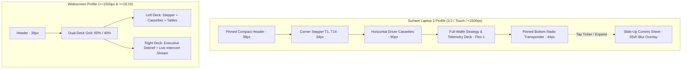

# Formula 1 AI Race Engineer — Option C Pit Wall Console Implementation Plan

## Goal Description
Implement the **Option C Pit Wall Console** designed in [`docs/ideas/gemini/03102026/f1_ai_race_engineer_ui_ux_implementation_plan.md`](file:///d:/coding/f1/franz-hermann/docs/ideas/gemini/03102026/f1_ai_race_engineer_ui_ux_implementation_plan.md). 

This architecture resolves the ergonomic and spatial constraints of the **Surface Laptop 3** (13.5" display, 3:2 aspect ratio, 150% Windows scaling &rarr; $1504 \times 1002\text{px}$ canvas, $\approx 880\text{px}-910\text{px}$ usable height, with $350\text{px}-400\text{px}$ on-screen touch keyboard impact). It replaces the cramped dual-pane column split with a **Full-Width Telemetry & Strategy Deck**, a **38px Pinned Compact Header**, **Horizontal Driver Cassettes** (120px height, saving 160px), a **Pinned 44px Bottom Radio Transponder Bar**, a **65vh Slide-Up Comms Sheet**, and **Bidirectional Deep-Linking** between LLM engineering debriefs and telemetry data tables.

On widescreen monitors and the **Alienware M15 R2** (`min-width: 1500px and min-aspect-ratio: 16/10`), the layout automatically transforms into an adaptive side-by-side dock (60% Telemetry Deck / 40% Permanent Intercom).

---

## User Review Required

> [!IMPORTANT]
> **Default Layout Profile Change**: Option C becomes the default layout for viewport widths under $1500\text{px}$ or aspect ratios under $16:10$ (specifically targeting the Surface Laptop 3's $3:2$ ratio at $1504\times1002$). The chat intercom will now live in a pinned bottom transponder bar (44px) that expands into a 65vh slide-up drawer on click or shortcut (`Ctrl + /`), instead of taking up a permanent right-hand column that squishes data tables.

> [!NOTE]
> **Adaptive Widescreen Auto-Docking**: When viewing on widescreen displays ($16:9$, $16:10$, ultrawide) with width $\ge 1500\text{px}$ (e.g. Alienware M15 R2), the CSS media queries automatically dock the Intercom and Debrief into a dedicated 40% right-hand pane, seamlessly restoring dual-pane ergonomics without user configuration.

> [!TIP]
> **Bidirectional Deep-Linking**: Any mention of a corner (`T1`–`T14`), track segment (`start-T1`, `T3-T4`), or telemetry system (`energy`, `tyre`) in the AI debrief or chat response becomes an interactive anchor chip. Clicking it immediately switches the active corner, navigates to the target tab, and applies a subtle flash highlight to the specific table row.

---

## Open Questions

1. **Standalone Demo File**:
   - Should we update the existing [`docs/demo.html`](file:///d:/coding/f1/franz-hermann/docs/demo.html) directly with the Option C architecture, or provide a separate [`docs/demo_option_c.html`](file:///d:/coding/f1/franz-hermann/docs/demo_option_c.html) while keeping the previous dual-pane demo intact? *(Recommendation: Update `docs/demo.html` to Option C so Gemini Web receives the latest production design, and archive the previous demo as `docs/demo_dual_pane_legacy.html`).*
2. **Keyboard Shortcut for Comms Drawer**:
   - `Ctrl + /` (or `Cmd + /`) will toggle the slide-up comms drawer open and closed. Is this hotkey acceptable, or would you prefer a single-key shortcut like `Space` or `R` (Radio)?

---

## Proposed Changes



### Component: CSS Tokens & Option C Grid Architecture

#### [MODIFY] [`ui/src/styles/tokens.css`](file:///d:/coding/f1/franz-hermann/ui/src/styles/tokens.css)
- Add Option C tokens: `--header-height: 38px`, `--transponder-height: 44px`, `--font-display: "Doto", "Space Mono", monospace`.
- Fine-tune surface tokens: `--surface-overlay: rgba(255, 255, 255, 0.94)` (light) / `rgba(14, 14, 14, 0.96)` (dark OLED).
- Add `--radius-cassette: 6px` and `--trans-speed: 140ms cubic-bezier(0.2, 0.0, 0.2, 1)`.

#### [MODIFY] [`ui/src/styles/components.css`](file:///d:/coding/f1/franz-hermann/ui/src/styles/components.css)
- Implement Option C layout scaffolding:
  - Header pinned at `38px`.
  - Main workspace: `height: calc(100vh - 38px - 44px)`, `display: flex; flex-direction: column; gap: 8px; padding: 6px 12px;`.
  - Horizontal Driver Cassettes grid: `display: grid; grid-template-columns: 1fr 1fr; gap: 8px;`.
  - Full-width analyzer deck: `flex: 1; min-height: 0; display: flex; flex-direction: column;`.
  - Pinned Transponder Bar: `position: fixed; bottom: 0; left: 0; right: 0; height: 44px; z-index: 100; border-top: 1px solid var(--border-visible); background: var(--surface);`.
  - Slide-Up Comms Drawer: `position: fixed; bottom: 44px; left: 0; right: 0; height: 65vh; max-height: calc(100vh - 82px); transform: translateY(100%); transition: transform 220ms cubic-bezier(0.16, 1, 0.3, 1); z-index: 99; backdrop-filter: blur(16px);`.
  - Backdrop dimmer: `.comms-backdrop` for closing drawer when clicking outside.
  - Adaptive Widescreen media query: `@media (min-width: 1500px) and (min-aspect-ratio: 16/10)`. Hides bottom bar, docks comms drawer statically into right 40% column.
  - Interactive chip anchors: `.chip-anchor` styling with hover underline and red highlight accent.
  - Row flash animation: `@keyframes flashRow { 0% { background: var(--accent-subtle); } 100% { background: transparent; } }`.

---

### Component: Pinned Compact Header

#### [MODIFY] [`ui/src/components/Header.ts`](file:///d:/coding/f1/franz-hermann/ui/src/components/Header.ts)
- Reduce vertical footprint from $52\text{px}$ to $38\text{px}$.
- Keep all telemetry controls:
  - Live pulse indicator + `PIT WALL // MELBOURNE`.
  - Session pill selector (`2026_01_R`, `2026_01_FP2`).
  - Dynamic constructor switcher (`McLaren [PIA/NOR]`, `Ferrari [LEC/HAM]`).
  - Run type pill toggle (`LONG RUN`, `PUSH`).
  - UTC Monospace clock + Light/OLED Dark toggle.

---

### Component: Corner Stepper & Horizontal Driver Cassettes

#### [MODIFY] [`ui/src/components/CornerDeck.ts`](file:///d:/coding/f1/franz-hermann/ui/src/components/CornerDeck.ts)
- Split into a dedicated compact **Corner Stepper Strip** (34px height) with touch-friendly 44px minimum target sizes and ArrowLeft/ArrowRight keyboard navigation.
- Redesign telemetry cards into **Horizontal Driver Cassettes**:
  - Two side-by-side hardware strips (`Driver A` vs `Driver B`).
  - Left sub-panel: Driver code, corner style badge (`V-STYLE` / `U-STYLE`), large minimum apex speed in `Doto` font ($28\text{px}-30\text{px}$), and IQR spread.
  - Right sub-panel: Discrete 10-block LED braking onset meter, full throttle re-pickup distance, deceleration G estimate, and rotation dwell ratio.
  - Reduces vertical consumption from $280\text{px}$ to $110\text{px}-120\text{px}$, leaving over $650\text{px}$ for analytical tables on Surface Laptop 3.

---

### Component: Full-Width Strategy & Telemetry Analyzer

#### [MODIFY] [`ui/src/components/TelemetryAnalyzer.ts`](file:///d:/coding/f1/franz-hermann/ui/src/components/TelemetryAnalyzer.ts)
- Add 5th tab: `[EXECUTIVE DEBRIEF]` to allow reviewing deep debrief summaries and setup hypotheses in full-width mode.
- Give tables full viewport width:
  - `Segment Deltas`: Full 90% confidence intervals (e.g. `[+0.082s, +0.202s]`) formatted in a single non-wrapping line with significance pill.
  - `Tyre Degradation`: Clean multi-column display showing compound, base pace, slope (s/lap), 90% CI, and fuel correction model.
  - `2026 Energy`: Clear straight-line table with speed loss and `#D71921` `[CLIPPING ALERT]` flags.
  - `Race Replay`: Lap 1–58 timeline scrubber with play/pause, speed multipliers, and real-time evolving leaderboard.
- Add row IDs (`id="row-segment-${s.segment}"`, `id="row-corner-${c}"`) to enable instant deep-link scroll targeting.

---

### Component: Pinned Radio Transponder & Slide-Up Comms Sheet

#### [NEW] [`ui/src/components/RadioTransponder.ts`](file:///d:/coding/f1/franz-hermann/ui/src/components/RadioTransponder.ts)
- Manages the collapsed 44px bottom bar and expanded 65vh comms drawer:
  - **Collapsed State**:
    - Status badge: `[● RADIO ACTIVE]` (pulsing green).
    - Rolling ticker: Displays the latest assistant message or debrief conclusion. Clicking expands the drawer.
    - Quick input pill: Lets the engineer ask a rapid question directly from the bottom bar without expanding the full drawer.
    - `[▲ EXPAND]` button.
  - **Expanded State**:
    - 65vh slide-up sheet with backdrop blur.
    - Header with active team/driver context and `[▼ COLLAPSE]` button.
    - Message history stream with auto-scroll and timestamps.
    - Grounded verification badges (`[VERIFIED FACT: DUCKDB]`).
    - Dynamic constructor suggestion chips (tailored to Ferrari, McLaren, Mercedes, Williams, etc.).
    - Comprehensive prompt input bar.
    - Touch-first dismissal (clicking outside or pressing `Escape` / `Ctrl + /`).

---

### Component: Bidirectional Deep-Linking & Event Wiring

#### [MODIFY] [`ui/src/main.ts`](file:///d:/coding/f1/franz-hermann/ui/src/main.ts)
- Integrate `RadioTransponder` into the main application loop.
- Implement regex text tokenizer to convert corner names (`T1`..`T14`) and segment names (`start-T1`, `T3-T4`) inside LLM messages and debrief cards into clickable `<button class="chip-anchor">` elements.
- Bind global click listener for `.chip-anchor`:
  - When clicked:
    1. Sets `state.selectedCorner = targetCorner`.
    2. Switches `state.selectedTelemetryTab = targetTab`.
    3. Finds corresponding table row by ID.
    4. Triggers `.flash-highlight` CSS class.
    5. Calls `element.scrollIntoView({ behavior: 'smooth', block: 'center' })`.
- Wire global keyboard listener:
  - `ArrowLeft` / `ArrowRight`: Navigate to previous / next corner.
  - `Ctrl + /`: Toggle comms drawer.
  - `Escape`: Close comms drawer if open.

---

### Component: Documentation & Standalone Demo Update

#### [MODIFY] [`docs/ideas/gemini/03102026/f1_ai_race_engineer_ui_ux_implementation_plan.md`](file:///d:/coding/f1/franz-hermann/docs/ideas/gemini/03102026/f1_ai_race_engineer_ui_ux_implementation_plan.md)
- Reformat the file to restore clean, unescaped markdown line breaks and complete the truncated Section 6 prototype so the design document is 100% complete and legible.

#### [MODIFY] [`docs/demo.html`](file:///d:/coding/f1/franz-hermann/docs/demo.html)
- Update the zero-dependency, standalone single-file HTML demo to incorporate Option C:
  - 38px compact header.
  - Horizontal driver cassettes.
  - Full-width strategy and telemetry deck.
  - Pinned bottom 44px radio transponder bar with live ticker and quick input.
  - 65vh slide-up comms drawer with backdrop blur.
  - Bidirectional deep-link chip anchors.
  - Adaptive widescreen auto-docking.

---

## Verification Plan

### Automated Tests
1. **Frontend TypeScript & Asset Build**:
   ```powershell
   cd d:\coding\f1\franz-hermann\ui
   npm run build
   ```
   Ensures zero TypeScript errors, clean imports, and optimal asset bundling.
2. **Backend & MCP Regression Tests**:
   ```powershell
   & .venv\Scripts\python.exe -m pytest tests/
   ```
   Verifies all 44 deterministic telemetry and LLM grounding tests pass.

### Manual & Browser Subagent Verification
1. **Surface Laptop 3 Simulation ($1504 \times 1002\text{px}$, 3:2 aspect ratio)**:
   - Launch browser subagent targeting `http://localhost:5173` and `docs/demo.html` resized to $1504 \times 1002$.
   - Confirm **zero entire-page vertical scrolling**; all elements fit within the viewport.
   - Verify Header is $38\text{px}$, Stepper + Cassettes are $\approx 120\text{px}$, and Analyzer table fills the remaining $\approx 680\text{px}$.
2. **Interactive Transponder & Slide-Up Comms Sheet**:
   - Verify the bottom transponder bar stays pinned at $44\text{px}$ with active green radio pulse.
   - Click `[▲ EXPAND]` or the rolling ticker; verify the 65vh drawer smoothly slides up over the deck with backdrop blur.
   - Submit a test prompt via quick input and full drawer input; confirm dynamic chips populate correctly.
   - Click `[▼ COLLAPSE]` or click outside; verify smooth collapse back to the bottom bar.
3. **Bidirectional Deep-Linking**:
   - In the intercom stream, click a `T3 ↗` anchor chip; verify active corner switches to T3, table switches to SEGMENTS, and T3-T4 row highlights.
4. **Adaptive Widescreen Auto-Docking Simulation ($1920 \times 1080\text{px}$, 16:9)**:
   - Resize browser window to $1920 \times 1080$.
   - Confirm layout switches to dual-pane split (60% Telemetry Deck / 40% Permanent Intercom), bottom transponder bar disappears, and comms drawer docks statically on the right.
5. **Theme Toggle**:
   - Toggle between Paper Light and OLED Dark mode; verify flawless contrast and Nothing Design tokens.
