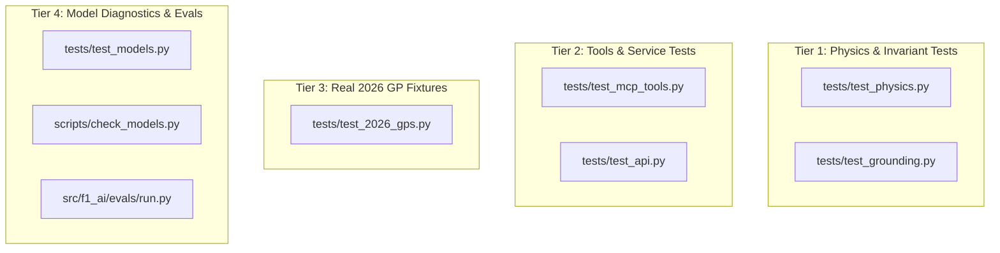

# Formula 1 AI Race Engineer — Testing & Benchmark Guide

This document covers the comprehensive testing strategy, invariant test suites, grounding assertions, and evaluation benchmarks used to ensure deterministic mathematical accuracy and reliable local LLM performance.

---

## 1. Test Architecture Overview

The system employs a strict multi-tier testing strategy:



---

## 2. Test Execution Commands

### 2.1 Fast Invariant & Service Test Suite (~5 seconds)

Run the fast deterministic tests (physics invariants, grounding rules, MCP tools, and FastAPI endpoints):

```powershell
& .venv\Scripts\python.exe -m pytest tests/test_physics.py tests/test_grounding.py tests/test_mcp_tools.py tests/test_api.py -v
```

Expected result: **27 passed** in ~3–5 seconds.

### 2.2 Physics Invariants Suite (`tests/test_physics.py`)

Verifies physical laws and mathematical constraints on telemetry processing:
- `test_corner_anchors`: Verifies corner marker coordinates align within tolerance without cross-over track confusion.
- `test_corner_metrics_braking_and_apex`: Ensures braking distances are positive, minimum apex speed is strictly lower than entry speed, and decel G is realistic.
- `test_segment_times_sum`: Ensures the sum of inter-corner segment times equals the total lap time.
- `test_teammate_deltas`: Tests bootstrap confidence interval calculations and significance flagging.
- `test_fit_degradation`: Verifies Theil-Sen fuel-corrected regression slopes on long-run tyre degradation.
- `test_straight_energy_signature`: Validates 2026 straight-line speed shape and electrical energy clipping detection.

```powershell
& .venv\Scripts\python.exe -m pytest tests/test_physics.py -v
```

### 2.3 Grounding & Anti-Hallucination Suite (`tests/test_grounding.py`)

Verifies that the LLM debrief generator cannot hallucinate numbers or invent new facts:
- `test_grounding_pass`: Verifies valid debrief containing only ground-truth numbers passes.
- `test_grounding_rejects_hallucinated_number`: Ensures any number not found in the deterministic fact sheet triggers validation rejection.
- `test_grounding_rejects_unknown_fact_key`: Prevents LLM from inventing new metric keys.
- `test_grounding_enforces_hypothesis_prefix`: Enforces that non-grounded opinions are strictly prefixed with `"HYPOTHESIS:"`.

```powershell
& .venv\Scripts\python.exe -m pytest tests/test_grounding.py -v
```

### 2.4 FastMCP Read-Only Tools Suite (`tests/test_mcp_tools.py`)

Validates all stdio MCP tools against in-memory DuckDB views:

```powershell
& .venv\Scripts\python.exe -m pytest tests/test_mcp_tools.py -v
```

### 2.5 Real 2026 Australian GP Suite (`tests/test_2026_gps.py`)

Validates against real 2026 Melbourne FP2 data (`2026_01_FP2`), covering 11 constructor teams, 22 drivers, Albert Park corners T1–T14, Hamilton at Ferrari, Antonelli at Mercedes, Cadillac, and Audi:

```powershell
& .venv\Scripts\python.exe -m pytest tests/test_2026_gps.py -v
```

### 2.6 FastAPI Backend Endpoints Suite (`tests/test_api.py`)

Tests the REST endpoints for sessions, drivers, corners, segments, tyres, energy, and highlights:

```powershell
& .venv\Scripts\python.exe -m pytest tests/test_api.py -v
```

### 2.7 Model Thinking Checks (`tests/test_models.py`)

Verifies that local Ollama models (`qwen3.5:4b` and `granite4.2:8b`) strictly produce non-thinking output (`think=False`) and output structured JSON:

```powershell
& .venv\Scripts\python.exe -m pytest tests/test_models.py -v
```

---

## 3. Local Model Speed Diagnostic

To benchmark CPU token generation speed and verify the absence of thinking tokens:

```powershell
& .venv\Scripts\python.exe scripts/check_models.py
```

---

## 4. Evaluation Benchmark (`evals/`)

The evaluation harness tests how well local models answer ground-truth telemetry questions using the MCP server.

### Ground-Truth Questions (`evals/questions.yaml`)
Contains verified race engineering questions covering:
- Segment deltas (`start-T1`)
- Tyre degradation slopes on Medium/Hard compounds
- Apex speeds in high-speed and low-speed corners
- Energy deployment clipping on straights

### Run Evaluation Suite

```powershell
& .venv\Scripts\python.exe -m f1_ai.evals.run --model qwen3.5:4b
```

Results are appended to [`evals/results.csv`](file:///d:/coding/f1/franz-hermann/evals/results.csv) logging:
- `accuracy`: Accuracy on ground-truth numeric metrics.
- `tool_call_error_rate`: Percentage of failed or malformed tool invocations.
- `avg_seconds_per_question`: Latency per query on local CPU.

---

## 5. Frontend Build Verification

To verify that the TypeScript application compiles with zero warnings and builds the production bundle:

```powershell
cd ui
npm run build
```
